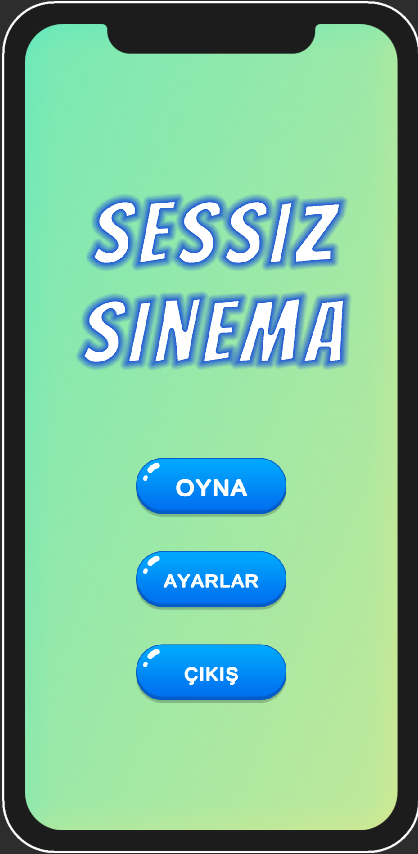
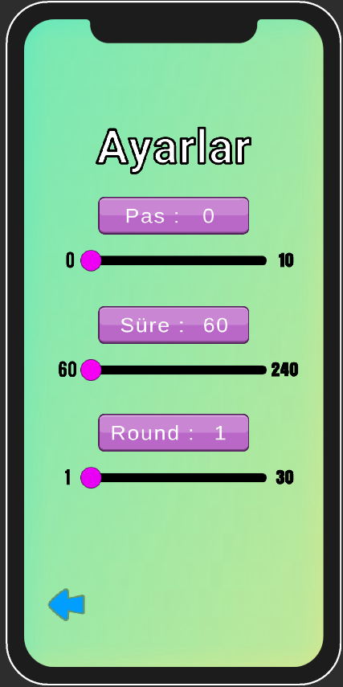
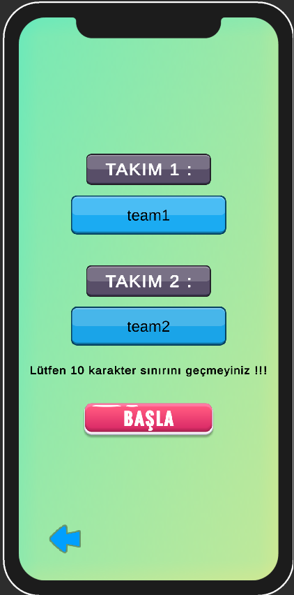
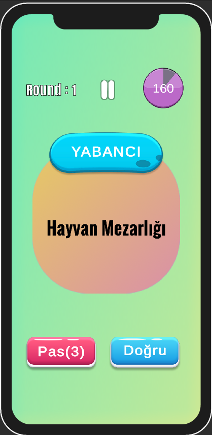
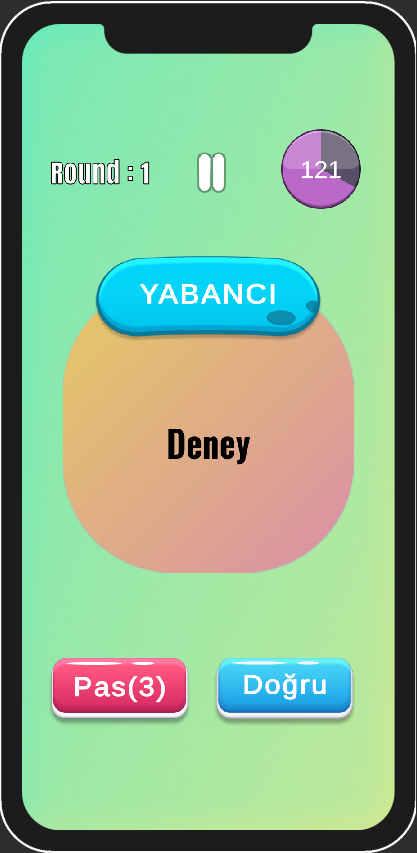
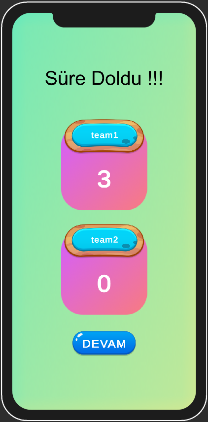

# Sessiz Sinema Oyunu

Bu proje, Unity kullanılarak geliştirilen bir mobil sessiz sinema oyunudur. Oyun, sessiz film döneminden ilham alınarak tasarlanmıştır ve oyunculara interaktif bir deneyim sunmayı hedeflemektedir.

## Özellikler

- **Sessiz Film Teması:** Oyun, 1920'lerin sessiz film döneminden esinlenerek tasarlanmıştır.
- **Mobil Uyumlu:** Unity ile geliştirilmiş olup mobil platformlarda oynanabilir.
- **Gelişmiş Grafikler:** Unity'nin güçlü grafik motoru kullanılarak görsel olarak zengin bir deneyim sunar.
- **Eğlenceli ve Eğitici:** Oyun, hem eğlenceli vakit geçirmeyi amaçlar.

## Nasıl Başlatılır

1. **Gereksinimler:**
   - Unity 2019 veya daha yeni bir sürümü.
   - Mobil oyun geliştirmeye uygun IDE (örneğin, Unity Hub).
   
2. **Kurulum:**
   - Bu reposu yerel makinenize klonlayın.
   - Unity Hub üzerinden projeyi açın.
   - Oyunu Unity içinde derleyin ve hedeflediğiniz platform için paketleyin.

3. **Oyunun Oynanışı:**
   - Oyunun kontrollerini açıklayın.
   - Temel oynanış mekaniklerini ve hedefleri tanıtın.

## Ekran Görüntüleri

## Katkıda Bulunma

- Projenin geliştirilmesine katkıda bulunmak isterseniz, lütfen bir fork oluşturun ve pull request gönderin.
- Kodunuzu değiştirirken ve yeni özellikler eklerken lütfen uygun şekilde test edin.

## Lisans

Bu proje MIT lisansı altında lisanslanmıştır. Detaylar için `LICENSE` dosyasına göz atın.
